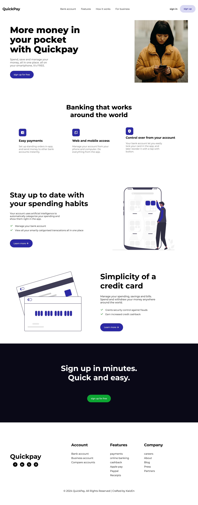

Here's a basic Markdown template for your GitHub repository named **Banking_Website**:


# Banking_Website

A dynamic and responsive banking website built using modern web development technologies. This project showcases a clean and user-friendly interface, with core banking functionalities.

## Features

- **Homepage:** Attractive landing page with an overview of services.
- **Account Management:** Features for users to view and manage their accounts.
- **Contact Us:** Form for users to reach out, with data-saving functionality.
- **Responsive Design:** Works seamlessly across devices.

## Technologies Used

- HTML5, CSS3, JavaScript

## Installation

1. Clone the repository:
   ```bash
   git clone https://github.com/OsuwakeEdet/banking_website.git
   ```
2. Navigate to the project directory:
   ```bash
   cd banking_website
   ```
3. Install dependencies:
   ```bash
   npm install
   ```
4. Start the application:
   ```bash
   npm start
   ```
5. Open your browser and go to `http://localhost:3000`.

## Usage

- Visit the homepage to explore services.
- Sign up/log in to manage accounts.
- Use the contact form to send inquiries.

## Screenshots




## License

This project is licensed under the [MIT License](LICENSE).

---

### Author

**Osuwake Emana**  
*Frontend Developer & Software Engineering Student*  
[LinkedIn](https://www.linkedin.com/in/your-link) | [Twitter](https://twitter.com/your-handle)  
